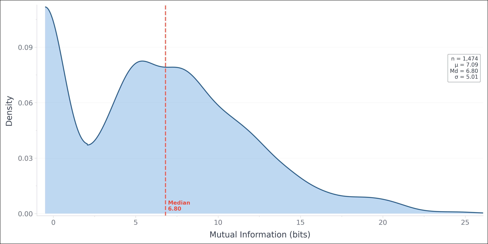

[](https://spacy.io)


<br />
<div align="center">
  

  <p align="center">
        Smash Text Into Obfuscated Formats
    <br />
    <br />
    <br />
    <a href="https://text-mallet.readthedocs.io/en/latest/">Read The Docs</a>
    &middot;
    <a href="https://github.com/DanielGall500/text-hammer/issues/new?labels=bug&template=bug-report---.md">Report Bug</a>
    &middot;
    <a href="https://github.com/DanielGall500/text-hammer/issues/new?labels=enhancement&template=feature-request---.md">Request Feature</a>
  </p>
</div>

A lightweight text transformation engine for smashing text into [derived](https://text-plus.org/en/themen-dokumentation/atf) formats. `text-mallet` reduces the risk of privacy or copyright infringement while preserving the structural, semantic, and syntactic utility of your data for downstream NLP tasks like classification, information retrieval, topic modeling, and semantic similarity.

The package natively supports text processing in **English** and **German**.

## Strategic Obfuscation

The central aim of text obfuscation using this package is to prevent **reconstructability**. Doing so involves eroding various aspects of text, such as:
* **Word Forms**: The exact sequence of characters.
* **Syntactic Features**: Morpho-syntactic token properties.
* **Meanings**: Core semantic associations.
* **Grammatical Relations**: Hierarchical sentence dependency tree structure.
* **Sequence Information**: Flat linear sequence boundaries.

Each layer contributes to the discoverability and reconstructibility of the source text. This package provides four main approaches to obfuscation: POS filtering, mutual information filtering, hierarchical scrambling, and bag-of-words. For a more detailed overview of each method, please see the [documentation](https://text-mallet.readthedocs.io/).

### Why Obfuscate Text?
When training models for text generation, we typically need all of the content and style of the original, fluent text. However, there are many tasks such as classification, semantic similarity scoring, topic modelling, and so on, where the original text may not be required in its original form to help model performance. There is typically a trove of public-domain data that can be used for model training, but there are still many questions around the usage of copyright-protected data in training. This package offers a route to preserve some of the value of copyrighted texts while hindering their reconstruction, whether that be through training-data reconstruction or model outputs.

The creation of transformed texts that are thus no longer consumable by humans, but still useful for training on specific tasks.

### Impact on Performance
While training on transformed text formats can introduce minor performance drops compared to raw text baselines, `text-mallett` is explicitly designed to **accompany** non-obfuscated, public-domain collections. Introducing these anonymised, non-human-consumable formats adds proprietary text signals into your pipeline without exposing the original text to model parameters. 

### Basic Obfuscation
There are multiple general obfuscation approaches to choose from, separated into three general categories:
* Structural Obfuscation (bag-of-words, hierarchical)
* Part-of-Speech Filtering 
* Mutual-Information Filtering

Let's start with an example of bag-of-words scrambling.
```python
from tmallet import TMallet

# 1. Define the Obfuscation Configuration
algorithm = "scramble-BoW"
config = {
    "level": "document",
}

# 2. Define Sample Text
sample = "Leipzig is the most populous city in the German state of Saxony. The city has a population of 633,592 residents as of 31 December 2025. It is the eighth-largest city in Germany and is part of the Central German Metropolitan Region. Leipzig is located about 150 km (90 mi) southwest of Berlin, in the southernmost part of the North German Plain (the Leipzig Bay), at the confluence of the White Elster and its tributaries Pleiße and Parthe."

# 3. Load Text Mallet and Obfuscate
tmallet = TMallet(lang="en", prefer_gpu=True)
tmallet.load_obfuscator(algorithm, config)

obfuscated_text_sample = tmallet.obfuscate(sample)
print(obfuscated_text_sample)
```

Output
```bash
southernmost 150 eighth-largest most the (90 Central located Bay), Parthe. mi) in city of German Germany part population the is Plain of populous and as Leipzig the German the the km White its Metropolitan Berlin, and Leipzig in the confluence 2025. of of city It Elster is Region. December tributaries The state Saxony. (the southwest the residents the of city Leipzig German is in is Pleiße of a has at part about of 31 and North 633,592
```

**Obfuscate based on an approximation of 'word importance'**
Mutual information measures how much information context tells you about a word.
Words which are both _rare_ and _context-dependant_ tend to be _important_ to the meaning of a text.
We can apply a filter to set upper or lower bounds on such an MI score, filering at the word level.
```python
from tmallet import TMallet

algorithm = "shannon", 
config = {
    "threshold": 7.5,
    "bound": "upper"
    "replacement_mechanism": "default"
}

tmallet = TMallet(lang=lang, prefer_gpu=True)
tmallet.load_obfuscator(algorithm, config)

text = "Leipzig is the most populous city in the German state of Saxony. The city has a population of 633,592 residents as of 31 December 2025. It is the eighth-largest city in Germany and is part of the Central German Metropolitan Region. Leipzig is located about 150 km (90 mi) southwest of Berlin, in the southernmost part of the North German Plain (the Leipzig Bay), at the confluence of the White Elster and its tributaries Pleiße and Parthe."
obfuscated = tmallet.obfuscate(text)
print(obfuscated)
```

Output
```json
"_ is the _ _ _ in the _ _ of _ . The _ _ a _ of _, _ _ as of _ _ _ . It is the _ - _ _  in _ and is _ of the _ _ _ _ . _ is _ _ _ _ (_ _) _ of _, in the _ _ of the _ _ _ (the _ Bay), at the _ of the Wh ite _ and _ _ _ and _.",
```

If we obfuscate too strongly using mutual information, we'll end up with obfuscated sentences like:
```
, . . - ., or . the / . the . - –, . -
```
That's, well, probably not very useful. Ideally, we can find a balance between the obfuscation of some words and inclusion of others. Using the bound as `lower` instead of `upper` will preserve those words which tend to be more meaningful in a text. Running the above example again with the lower bound of 7.5, we get:
```

```
Here's an overview of an approximation of pointwise word-level mutual information, i.e. PMI(word; context), over 12,000 tokens taken from 10 random texts in the FineWeb-Edu dataset, for instance.

